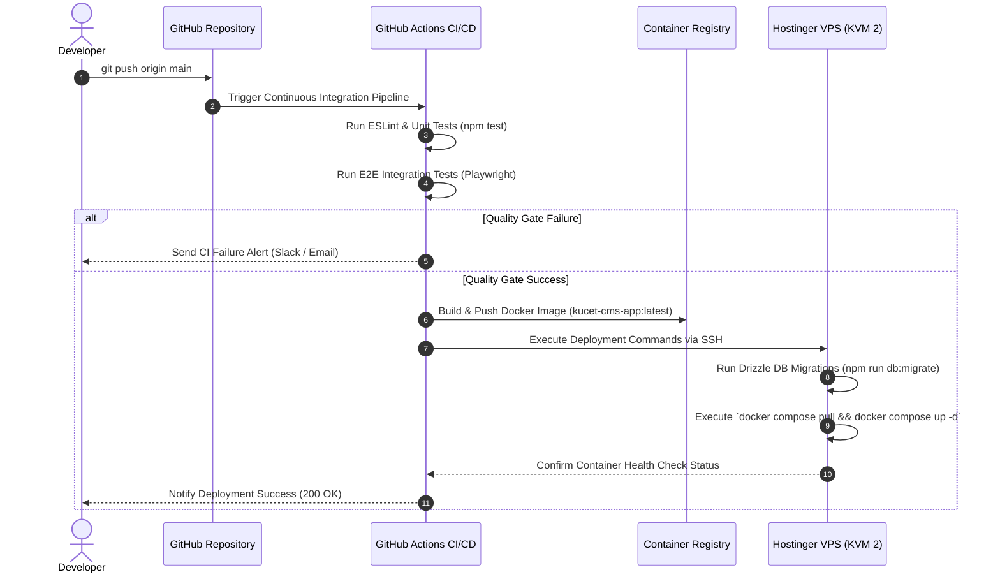

# 🚀 Production Deployment Architecture & DevOps Specification

This document provides a detailed specification of the production deployment topology, multi-container Docker Compose setup, Nginx reverse proxy configuration, and automated CI/CD pipeline for the **Kakatiya University College of Engineering and Technology (KUCET) Management System**.

---

## 📌 Related Documentation
- [Master Index](../README.md)
- [System Architecture](./system-architecture.md)
- [Backend Architecture](./backend.md)
- [Database Architecture](./database.md)
- [Storage Architecture](./storage.md)

---

## 💻 Production Hardware & Topology

The KUCET CMS application is hosted on a **Hostinger VPS KVM 2** virtual private server running Ubuntu 24.04 LTS.

### Host Topology Specifications
- **Virtual CPU**: 4 Dedicated vCPU Cores
- **System Memory**: 16 GB DDR5 RAM
- **Storage Tier**: 200 GB NVMe SSD Storage
- **Network Bandwidth**: 8 TB / Month (1 Gbps Uplink)
- **Primary Domain**: Hostinger VPS Ingress with Let's Encrypt Wildcard SSL Certificates

```
                                +-----------------------------------+
                                |       Internet Traffic (Clients)  |
                                +-----------------------------------+
                                                  |
                                                  v
                                +-----------------------------------+
                                |  Tailscale Funnel / VPS Ingress   |
                                +-----------------------------------+
                                                  |
                                                  v
                                +-----------------------------------+ ===> Mounted Storage: /var/www/kucet-storage:ro
                                |  Nginx Reverse Proxy Container    |
                                |     (Ports 80 / 443 | HTTP/2)     |
                                +-----------------------------------+
                                                  |
          +-----------------------+---------------+-----------------------+
          |                       |               |                       |
          v                       v               v                       v
+--------------------+ +--------------------+ +-------+ +------------------------------------+
| Next.js 16 App     | | Socket.IO Realtime | | Redis | | Uptime Kuma Monitor Container      |
| Container (Node 20)| | Container (Node 20)| |   7   | |            (Port 3001)             |
|    (Port 3000)     | |    (Port 4000)     | |(6379) | |                                    |
+--------------------+ +--------------------+ +-------+ +------------------------------------+
          |                                       |
          v                                       v
+------------------------------------+  +-------------------+
| Mounted Persistent Storage Volume: |  | Mounted Volume:   |
| /var/www/kucet-storage             |  | redis-data:/data  |
+------------------------------------+  +-------------------+
```

---

## 🐳 Multi-Container Docker Compose Stack (`docker-compose.yml`)

Production services are orchestrated using Docker Compose inside an isolated bridge network (`cms-network`).

```yaml
name: deployment_package

services:
  app:
    build:
      context: .
      dockerfile: DEPLOYMENT_PACKAGE/Dockerfile
    container_name: kucet-cms-app
    restart: always
    expose:
      - "3000"
    ports:
      - "127.0.0.1:3000:3000"
    env_file:
      - .env.production
    volumes:
      - /var/www/kucet-storage:/app/storage
    depends_on:
      db:
        condition: service_healthy
      redis:
        condition: service_healthy
    healthcheck:
      test: ["CMD-SHELL", "wget --no-verbose --tries=1 --spider http://127.0.0.1:3000/api/health || exit 1"]
      interval: 15s
      timeout: 5s
      retries: 3
      start_period: 20s
    networks:
      - cms-network

  realtime:
    build:
      context: .
      dockerfile: DEPLOYMENT_PACKAGE/Dockerfile.realtime
    container_name: kucet-cms-realtime
    restart: unless-stopped
    expose:
      - "4000"
    ports:
      - "127.0.0.1:4000:4000"
    env_file:
      - .env.production
    environment:
      - REDIS_URL=redis://redis:6379
      - SOCKET_PORT=4000
      - SOCKET_HOST=0.0.0.0
      - CORS_ORIGIN=*
    healthcheck:
      test: ["CMD-SHELL", "node -e \"require('http').get('http://127.0.0.1:4000/health', (r) => process.exit(r.statusCode === 200 ? 0 : 1)).on('error', () => process.exit(1))\""]
      interval: 15s
      timeout: 5s
      retries: 3
      start_period: 10s
    depends_on:
      redis:
        condition: service_healthy
    networks:
      - cms-network

  nginx:
    image: nginx:alpine
    container_name: kucet-cms-proxy
    restart: always
    ports:
      - "80:80"
    volumes:
      - ./DEPLOYMENT_PACKAGE/nginx/nginx.conf:/etc/nginx/nginx.conf:ro
      - /var/www/kucet-storage:/usr/share/nginx/html/storage:ro
    depends_on:
      app:
        condition: service_healthy
      realtime:
        condition: service_healthy
    healthcheck:
      test: ["CMD-SHELL", "wget --no-verbose --tries=1 --spider http://127.0.0.1:80/api/health || exit 1"]
      interval: 15s
      timeout: 5s
      retries: 3
      start_period: 15s
    networks:
      - cms-network

  redis:
    image: redis:7-alpine
    container_name: kucet-cms-redis
    restart: always
    command: redis-server --appendonly yes
    ports:
      - "127.0.0.1:6379:6379"
    volumes:
      - redis-data:/data
    healthcheck:
      test: ["CMD", "redis-cli", "ping"]
      interval: 10s
      timeout: 5s
      retries: 5
    networks:
      - cms-network
```

---

## ⚡ Nginx Upstream Optimization (`nginx.conf`)

The **Nginx** container acts as the primary ingress edge, terminating SSL, handling WebSocket upgrades, compressing assets, and protecting authentication routes against brute-force rate attacks.

### Nginx Configuration Highlights

```nginx
events {
    worker_connections 2048;
}

http {
    include       mime.types;
    default_type  application/octet-stream;
    sendfile        on;
    tcp_nopush      on;
    tcp_nodelay     on;
    keepalive_timeout 65;

    # Rate Limiting Zones
    limit_req_zone $binary_remote_addr zone=auth_limit:10m rate=5r/s;
    limit_req_zone $binary_remote_addr zone=api_limit:10m rate=30r/s;

    # Gzip & Brotli Compression
    gzip on;
    gzip_comp_level 6;
    gzip_types text/plain text/css application/json application/javascript text/xml application/xml;

    upstream nextjs_upstream {
        server app:3000 max_fails=3 fail_timeout=10s;
        keepalive 32;
    }

    server {
        listen 80;
        server_name cms.kucet.ac.in;
        return 301 https://$host$request_uri;
    }

    server {
        listen 443 ssl http2;
        server_name cms.kucet.ac.in;

        ssl_certificate /etc/letsencrypt/live/cms.kucet.ac.in/fullchain.pem;
        ssl_certificate_key /etc/letsencrypt/live/cms.kucet.ac.in/privkey.pem;
        ssl_protocols TLSv1.2 TLSv1.3;

        # Static Public Uploads Direct Delivery
        location /uploads/ {
            alias /usr/share/nginx/html/uploads/;
            expires 30d;
            add_header Cache-Control "public, no-transform";
        }

        # Auth Route Rate Limiting
        location /api/auth/ {
            limit_req zone=auth_limit burst=10 nodelay;
            proxy_pass http://nextjs_upstream;
            proxy_set_header Host $host;
            proxy_set_header X-Real-IP $remote_addr;
            proxy_set_header X-Forwarded-For $proxy_add_x_forwarded_for;
        }

        # Realtime WebSocket Proxying (Supabase & SSE)
        location /api/realtime/ {
            proxy_pass http://nextjs_upstream;
            proxy_http_version 1.1;
            proxy_set_header Upgrade $http_upgrade;
            proxy_set_header Connection "Upgrade";
            proxy_read_timeout 86400s;
        }

        # Application Route Proxying
        location / {
            limit_req zone=api_limit burst=50 nodelay;
            proxy_pass http://nextjs_upstream;
            proxy_http_version 1.1;
            proxy_set_header Host $host;
            proxy_set_header X-Real-IP $remote_addr;
            proxy_set_header X-Forwarded-For $proxy_add_x_forwarded_for;
            proxy_set_header X-Forwarded-Proto $scheme;
        }
    }
}
```

---

## 🤖 Automated CI/CD Pipeline & Deployment Workflow

Deployment is fully automated using GitHub Actions workflows (`.github/workflows/deploy.yml`).

### Workflow Quality Gates
1. **ESLint & Code Formatting Check**: Executes `npm run lint` to enforce standard syntax rules.
2. **Unit & Integration Test Suite**: Executes `npm test` via Vitest.
3. **End-to-End (E2E) Test Suite**: Executes Playwright test suites (`npx playwright test`).
4. **Docker Image Build**: Compiles Next.js standalone build in Docker context and tags image.
5. **VPS Deployment via Self-Hosted Runner**:
   - Executes automated database snapshot (`DEPLOYMENT_PACKAGE/SCRIPTS/nightly-backup.sh`).
   - Runs Drizzle DB migrations (`npm run db:migrate`).
   - Rebuilds and restarts the Next.js app and Socket.IO realtime containers.
   - Validates Nginx reverse proxy configuration (`nginx -t`) and executes safe reload.
   - Runs the comprehensive 23-point system health check (`DEPLOYMENT_PACKAGE/SCRIPTS/health-check.sh`).
   - Automatically triggers atomic rollback if any critical service check fails.

### CI/CD Invariants & Operational Standards
- **Git Working Tree Invariant**: In deployment pipelines, Git checkout must NEVER fail due to local working tree drifts. Deployment scripts use atomic remote reset:
  ```bash
  git fetch origin "$BRANCH" 2>&1
  git reset --hard "origin/$BRANCH" 2>&1
  git clean -fd 2>&1
  ```
- **Canonical File Mode Tracking**: All shell scripts in `DEPLOYMENT_PACKAGE/SCRIPTS/` are tracked with executable bit `100755` in the Git index (`git update-index --chmod=+x`), preventing runtime `chmod +x` commands from marking files as dirty on Linux.
- **Server User & Group Ownership**: `/var/www/kucet-cms` is owned by `deployer:users` (UID `1001:100`) with permissions `u+rwX,g+rwX`. This allows both the GitHub Actions runner daemon (`deployer`) and SSH maintenance users (`kucet-dev`) to execute builds, update files, and write logs without permission errors.
- **Persistent Storage Volumes**: Host directory `/var/www/kucet-storage` is owned by UID `1001:1001` with `755` permissions, mounted inside containers at `/app/storage` to preserve user uploads independently of code checkouts.

---

## 🌐 Dual Ingress Architecture: Private Tailnet Mesh vs Public Funnel Edge Relays

The self-hosted deployment supports two distinct traffic ingress paths:

1. **Private Tailnet Route (Admin / Development Laptop):**
   - **Mechanism:** The laptop runs the Tailscale client and is joined to the tailnet (`official.kucet@`, IP `100.78.176.78`).
   - **Resolution:** Tailscale MagicDNS intercepts `kucet-dev-hp-pro-tower-280-g9-pci-desktop-pc.tailf6b4a7.ts.net` and resolves it directly to the internal overlay IP **`100.102.153.50`**.
   - **Path:** Traffic flows strictly through the encrypted WireGuard peer mesh or direct DERP tunnel, completely bypassing public internet DNS, external firewalls, and carrier routing.

2. **Public Internet Ingress Route (Students, Faculty Mobile Devices, General Public):**
   - **Mechanism:** External mobile devices (4G/5G/Broadband) have no Tailscale client installed.
   - **Resolution:** Public DNS (Google `8.8.8.8`, Cloudflare `1.1.1.1`, or telecom carrier DNS) resolves `*.tailf6b4a7.ts.net` to Tailscale's public Funnel edge proxy IPs (`103.84.155.217`, `103.84.155.153`, and IPv6 `2403:...`).
   - **Path:** Requests connect to Tailscale's public Funnel edge relays. Tailscale terminates external TLS with Let's Encrypt certificates, tunnels the requests over the DERP control channel to the host machine's `tailscaled` daemon, which forwards decrypted HTTP traffic to `http://127.0.0.1:80` (Nginx) -> Next.js container (`http://127.0.0.1:3000`).

---



---

## 🛡️ Disaster Recovery & Backup Strategy

- **Database Snapshots**: Automated daily database export script (`src/db/backup.js`) dumps schema and data, uploading compressed `.sql.gz` archives to S3 storage and local backup volumes.
- **Persistent Volume Mounts**: VPS directory `/var/www/kucet-storage` is mounted persistently across container restarts to preserve uploaded documents.

---

> 💡 **Next Steps**: Return to the [Master Index](../README.md) for a summary of all system documentation.
