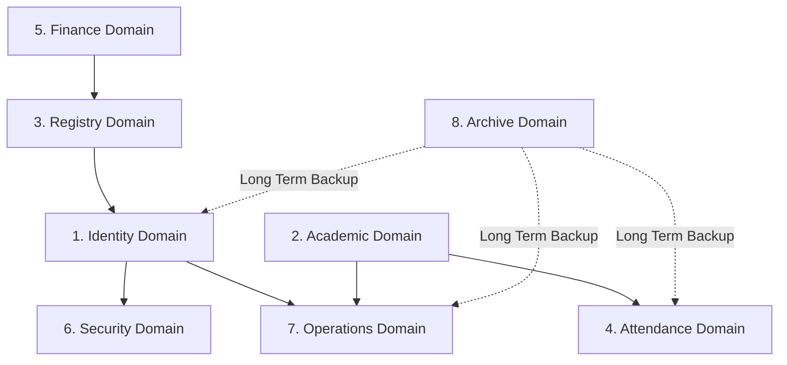

# Database Schema Reference

## Overview

The KUCET CMS database architecture is divided into 8 modular domains using Drizzle ORM (`drizzle-orm/mysql-core`). The MySQL database is configured with UTF-8 character encoding and InnoDB engine support to ensure ACID transactional compliance.

> **Session 207 Note:** 7 new tables were added and 1 renamed in the `testvanilla` branch. See [Section 1b](#1b-session-207-new-staff-identity-tables) and [Session 207 Change Analysis](../history/session-207-testvanilla-changes.md).

---

## Domain Architecture Overview

---

## 1. Identity Domain

Responsible for user authentication, accounts, roles, credentials, and session tokens.

### Table: `students`
Primary identity table for enrolled students.
- `id` (`INT`, PK, Auto-Increment)
- `admission_no` (`VARCHAR(255)`)
- `roll_no` (`VARCHAR(255)`, Unique Index: `uq_students_roll_no`, Index: `idx_roll_no`)
- `fee_reimbursement` (`ENUM('YES', 'NO', 'GOV')`, Default: `'NO'`)
- `name` (`VARCHAR(255)`)
- `date_of_birth` (`DATE`)
- `gender` (`VARCHAR(50)`)
- `mobile` (`VARCHAR(255)` - AES-256 Encrypted)
- `mobile_hash` (`VARCHAR(64)`, Index: `idx_students_mobile_hash` - Blind Index)
- `email` (`VARCHAR(255)`, Index: `idx_students_email`)
- `created_at` (`TIMESTAMP`, Default: `NOW()`, Index: `idx_students_created_at`)
- `is_email_verified` (`BOOLEAN`, Default: `false`)
- `email_verified_at` (`TIMESTAMP`)
- `password_hash` (`VARCHAR(255)`)
- `admission_date` (`DATE`)
- `added_by_staff_id` (`INT`)
- `updated_at` (`TIMESTAMP`, On Update: `NOW()`)
- `updated_by_staff_id` (`INT`)
- `student_status` (`ENUM('ACTIVE', 'DISCONTINUED')`, Default: `'ACTIVE'`)
- `academic_status` (`ENUM('REGULAR', 'ACTIVE', 'GRADUATED', 'DETAINED', 'SUSPENDED', 'DROPPED')`, Default: `'ACTIVE'`)
- `academic_offset_years` (`INT`, Default: `0`)
- `last_login_at` (`TIMESTAMP`)
- `last_login_ip` (`VARCHAR(64)`)
- `password_changed_at` (`TIMESTAMP`)

### Table: `clerks`
Legacy identity table for pre-Session 207 accounts (retained for migration reads).
⚠️ Active staff accounts reside in `staff_accounts`.
- `id` (`INT`, PK, Auto-Increment)
- `name` (`VARCHAR(255)`, Not Null)
- `email` (`VARCHAR(255)`, Not Null, Index: `idx_clerks_email`)
- `employee_id` (`VARCHAR(255)`, Index: `idx_clerks_employee_id`)
- `password_hash` (`VARCHAR(255)`, Not Null)
- `role` (`VARCHAR(50)`, Default: `'scholarship'`, Not Null)
- `mobile` (`VARCHAR(255)` - Encrypted)
- `mobile_hash` (`VARCHAR(64)`)
- `pfp` (`TEXT` - Profile Image URL)
- `signature` (`TEXT` - Digital Signature URL)
- `address` (`TEXT`)
- `is_active` (`BOOLEAN`, Default: `true`, Not Null)
- `is_hod` (`BOOLEAN`, Default: `false`)
- `branch` (`VARCHAR(50)`)
- `last_login_at` (`TIMESTAMP`)
- `last_login_ip` (`VARCHAR(64)`)

### Table: `principal`
Super Admin account details.
- `id` (`INT`, PK, Auto-Increment)
- `email` (`VARCHAR(255)`, Not Null, Index: `idx_principal_email`)
- `password_hash` (`VARCHAR(255)`, Not Null)
- `last_login_at` (`TIMESTAMP`)
- `last_login_ip` (`VARCHAR(64)`)

### Table: `user_sessions`
Active device tracking and session storage.
- `id` (`BIGINT`, PK, Auto-Increment)
- `user_type` (`ENUM('STUDENT', 'STAFF', 'ADMIN', 'SYSTEM')`)
- `user_id` (`BIGINT`, Composite Index: `idx_user_sessions_user` with `user_type`)
- `session_token_hash` (`VARCHAR(255)`, Index: `idx_user_session_token`)
- `device_name` (`VARCHAR(255)`)
- `browser` (`VARCHAR(100)`)
- `operating_system` (`VARCHAR(100)`)
- `ip_address` (`VARCHAR(64)`)
- `location` (`VARCHAR(255)`)
- `is_current` (`BOOLEAN`, Default: `false`)
- `is_revoked` (`BOOLEAN`, Default: `false`)
- `last_seen_at` (`TIMESTAMP`, Index: `idx_user_sessions_last_seen`)
- `created_at` (`TIMESTAMP`, Default: `NOW()`)
- `expires_at` (`TIMESTAMP`)

---

## 1b. Session 207 — New Staff Identity Tables

> Added in `testvanilla` branch (Session 207). Migration pending.

### Table: `staff_accounts`
Unified identity table for all staff registered via the new onboarding pipeline. Replaces `clerks` for new hires.
- `id` (`INT`, PK, Auto-Increment)
- `name` (`VARCHAR(255)`, Not Null)
- `email` (`VARCHAR(255)`, Not Null, Unique Index: `idx_staff_email`)
- `employee_id` (`VARCHAR(255)`, Not Null, Unique Index: `idx_staff_employee_id`)
- `password_hash` (`VARCHAR(255)`) — null until activation
- `staff_category` (`VARCHAR(50)`, Not Null) — `'FACULTY'` | `'NON_TEACHING'`
- `designation` (`VARCHAR(100)`, Not Null)
- `mobile_hash` (`VARCHAR(255)`) — AES-256 encrypted mobile string (expanded in Session 207 from 64 to 255)
- `pfp` (`TEXT`) — relative storage key
- `signature` (`TEXT`) — relative storage key
- `address` (`TEXT`)
- `account_status` (`ENUM('PENDING_ACTIVATION', 'ACTIVE', 'SUSPENDED')`, Default: `'PENDING_ACTIVATION'`)
- `created_at` (`TIMESTAMP`, Default: `NOW()`)
- `updated_at` (`TIMESTAMP`, On Update: `NOW()`)

### Table: `faculty_hod_assignments`
Tracks Head of Department (HOD) faculty assignments per academic year and department.
- `id` (`INT`, PK, Auto-Increment)
- `staff_account_id` (`INT`, Not Null, Index: `idx_hod_staff_id`) → FK `staff_accounts.id`
- `department_code` (`VARCHAR(20)`, Not Null, Index: `idx_hod_dept_code`)
- `academic_year` (`VARCHAR(9)`, Not Null)
- `start_date` (`DATE`, Not Null)
- `end_date` (`DATE`)
- `is_active` (`BOOLEAN`, Default: `true`, Not Null)
- `assigned_by` (`INT`) → FK `principal.id` (nullable)
- `created_at` (`TIMESTAMP`, Default: `NOW()`)
- `updated_at` (`TIMESTAMP`, On Update: `NOW()`)

### Table: `staff_roles`
Lookup table of valid role codes. Prevents hardcoded strings across the codebase.
- `id` (`INT`, PK, Auto-Increment)
- `role_code` (`VARCHAR(50)`, Not Null, Unique: `uq_staff_roles_code`)
- `description` (`TEXT`)
- `created_at` (`TIMESTAMP`, Default: `NOW()`)

**Seed rows required:** `FACULTY`, `ADMISSION_CLERK`, `SCHOLARSHIP_CLERK`

### Table: `staff_account_roles`
Many-to-many junction between `staff_accounts` and `staff_roles`. Supports future multi-role assignment.
- `id` (`INT`, PK, Auto-Increment)
- `staff_account_id` (`INT`, Not Null, Index: `idx_staff_account_roles_staff`) → FK `staff_accounts.id`
- `role_id` (`INT`, Not Null, Index: `idx_staff_account_roles_role`) → FK `staff_roles.id`
- `assigned_at` (`TIMESTAMP`, Default: `NOW()`)
- `assigned_by` (`INT`) → FK `principal.id` (nullable)

### Table: `staff_academic_affiliations`
Links faculty staff to their department and optionally a specific program. Replaces flat `clerks.branch` column.
- `id` (`INT`, PK, Auto-Increment)
- `staff_account_id` (`INT`, Not Null, Index: `idx_staff_affil_id`) → FK `staff_accounts.id`
- `department_id` (`INT`, Not Null) → FK `academic_departments.id`
- `program_id` (`INT`) — nullable → FK `academic_programs.id`
- `is_hod` (`BOOLEAN`, Default: `false`) — HOD flag per department
- `created_at` (`TIMESTAMP`, Default: `NOW()`)

### Table: `staff_account_activation_tokens`
Secure one-time tokens for email-based account activation. Raw token is never stored — only SHA-256 hash.
- `id` (`INT`, PK, Auto-Increment)
- `staff_account_id` (`INT`, Not Null, Index: `idx_staff_activation_staff`) → FK `staff_accounts.id`
- `token_hash` (`VARCHAR(255)`, Not Null, Unique Index: `idx_staff_activation_token`)
- `expires_at` (`TIMESTAMP`, Not Null) — 48 hours from creation
- `used_at` (`TIMESTAMP`) — set on successful activation (null = unused)
- `created_at` (`TIMESTAMP`, Default: `NOW()`)

### Table: `academic_departments`
Institutional department registry. Represents the top level of the academic hierarchy (e.g., Computer Science, Mechanical). Used for faculty affiliation, HOD assignments, and grouping programs.
- `id` (`INT`, PK, Auto-Increment)
- `department_code` (`VARCHAR(50)`, Not Null, Unique)
- `department_name` (`VARCHAR(255)`, Not Null)
- `is_active` (`BOOLEAN`, Default: `true`)
- `created_at` (`TIMESTAMP`)
- `updated_at` (`TIMESTAMP`, On Update: `NOW()`)

### Table: `academic_programs`
Programs/courses offered by each department, representing the second level of the hierarchy (e.g., B.Tech CSE, M.Tech CSE). A department can have multiple programs.
- `id` (`INT`, PK, Auto-Increment)
- `department_id` (`INT`, Not Null, Index: `idx_academic_programs_dept`) → FK `academic_departments.id`
- `program_code` (`VARCHAR(50)`, Not Null, Unique)
- `program_name` (`VARCHAR(255)`, Not Null)
- `is_active` (`BOOLEAN`, Default: `true`)
- `created_at` (`TIMESTAMP`)
- `updated_at` (`TIMESTAMP`, On Update: `NOW()`)

### Table: `staff_registration_requests` *(Renamed from `clerk_registration_requests`)*
Pending staff self-registration requests awaiting admin approval.
- `id` (`INT`, PK, Auto-Increment)
- `name`, `email`, `designation` — applicant details
- `requested_role` (`VARCHAR(50)`) — **NEW:** `'FACULTY'` | `'ADMISSION_CLERK'` | `'SCHOLARSHIP_CLERK'`
- `academic_affiliations` (`JSON`) — **NEW:** `[{department_code, program_codes[]}]`
- `mobile_hash` (`VARCHAR(64)`) — blind index
- `email_verified_at` (`TIMESTAMP`) — **NEW:** set when OTP verified
- `status` (`ENUM('PENDING', 'APPROVED', 'REJECTED')`, Default: `'PENDING'`)
- `admin_notes` (`TEXT`)
- `created_at`, `updated_at`

**Dropped columns (Session 207):** `branch`, `department`, `mobile` (encrypted)

---

## 2. Academic Domain

Stores curriculum data, syllabus structures, elective group buckets, academic calendars, and department configurations.

### Table: `syllabus_subjects`
Global subject catalogue defining all theoretical and laboratory subjects across regulations.
- `subject_code` (`VARCHAR(50)`, PK) — unique identifier (e.g. `CS501PC`, `EC302ES`)
- `subject_name` (`VARCHAR(255)`, Not Null) — subject title
- `subject_type` (`ENUM('theory', 'lab')`, Not Null)

### Table: `syllabus_structure`
Branch and semester curriculum mapping for core subjects.
- `id` (`INT`, PK, Auto-Increment)
- `branch` (`VARCHAR(50)`, Not Null) — Department branch (e.g. `CSE`, `ECE`, `EEE`, `MECH`, `CIVIL`, `CSD`, `IT`)
- `semester` (`TINYINT`, Not Null) — Semester index (1 through 8)
- `subject_code` (`VARCHAR(50)`, Not Null) → FK `syllabus_subjects.subject_code` (`onDelete: 'restrict'`)
- `is_group` (`BOOLEAN`, Default: `false`)
- `parent_group_code` (`VARCHAR(50)`)
- **Indexes:** `branch` on `(branch, semester)`, `subject_code` on `subject_code`
- **Unique Index:** `unique_mapping` on `(branch, semester, subject_code)`

### Table: `elective_groups` *(New)*
Curriculum elective grouping buckets (Professional Electives, Open Electives, Mandatory Non-Credit courses).
- `id` (`INT`, PK, Auto-Increment)
- `branch` (`VARCHAR(50)`, Not Null) — Department branch
- `semester` (`TINYINT`, Not Null) — Semester index (1 through 8)
- `group_code` (`VARCHAR(50)`, Not Null) — Unique code within branch/sem (e.g. `PE-I`, `PE-II`, `OE-I`, `MC-I`)
- `group_name` (`VARCHAR(255)`, Not Null) — Human-readable group name (e.g. `Professional Elective - I`)
- `group_type` (`ENUM('PROFESSIONAL_ELECTIVE', 'OPEN_ELECTIVE', 'MANDATORY_NON_CREDIT', 'OTHER')`, Not Null)
- `subject_mode` (`ENUM('theory', 'lab')`, Default: `'theory'`, Not Null)
- `sequence_num` (`TINYINT`, Default: `0`, Not Null) — Sequence position
- `display_order` (`INT`, Default: `0`, Not Null)
- `is_active` (`BOOLEAN`, Default: `true`, Not Null)
- `created_at` (`TIMESTAMP`, Default: `NOW()`)
- **Unique Index:** `uq_elective_group` on `(branch, semester, group_code)`
- **Index:** `idx_eg_branch_sem` on `(branch, semester)`

### Table: `elective_group_subjects` *(New)*
Junction mapping subjects to specific elective groups.
- `id` (`INT`, PK, Auto-Increment)
- `group_id` (`INT`, Not Null, Index: `idx_egs_group_id`) → FK `elective_groups.id` (`onDelete: 'restrict'`)
- `subject_code` (`VARCHAR(50)`, Not Null) → FK `syllabus_subjects.subject_code` (`onDelete: 'restrict'`)
- `display_order` (`INT`, Default: `0`, Not Null)
- `created_at` (`TIMESTAMP`, Default: `NOW()`)
- **Unique Index:** `uq_group_subject` on `(group_id, subject_code)`

### Table: `academic_calendar`
Academic term start/end dates, holiday schedules, and examination windows.
- `id` (`INT`, PK, Auto-Increment)
- `academic_year` (`VARCHAR(9)`, Not Null) — e.g. `2025-2026`
- `semester` (`TINYINT`, Not Null) — Semester index (1-8)
- `start_date` (`DATE`, Not Null)
- `end_date` (`DATE`, Not Null)
- `is_current` (`BOOLEAN`, Default: `false`)

### Table: `system_configs` & `college_info`
Institutional key-value configurations, branding signatures, and college accreditation metadata.

---

## 3. Registry Domain

Manages student enrollment, personal demographics, academic history, admission drafts, soft rejection tracking, and document verification.

### Table: `student_admission_drafts`
Staging table for multi-step admission intake applications before final roll number assignment and active student provisioning.
- `id` (`INT`, PK, Auto-Increment)
- `status` (`ENUM('DRAFT', 'PROCESSED', 'FINALIZED', 'REJECTED')`, Default: `'DRAFT'`, Not Null, Index: `idx_draft_status`)
- `admission_year` (`VARCHAR(9)`, Not Null) — e.g. `2026-2030`
- `entrance_exam` (`VARCHAR(10)`, Not Null) — `TG EAPCET`, `TG ECET`, `PGECET`, `Other`
- `branch` (`VARCHAR(50)`, Not Null)
- `name` (`VARCHAR(255)`, Not Null)
- `father_name`, `mother_name` (`VARCHAR(255)`)
- `dob` (`DATE`), `gender` (`VARCHAR(10)`)
- `email` (`VARCHAR(255)`, Index: `idx_draft_email`)
- `student_mobile` (`VARCHAR(255)` - AES-256 Encrypted)
- `mobile_hash` (`VARCHAR(64)`, Index: `idx_draft_mobile_hash` - Blind Index)
- `guardian_mobile` (`VARCHAR(255)` - AES-256 Encrypted)
- `pfp` (`TEXT` - Storage Provider URI)
- `signature` (`TEXT` - Storage Provider URI)
- `exam_rank` (`INT`), `area_status` (`VARCHAR(50)`), `category` (`VARCHAR(50)`), `sub_caste` (`VARCHAR(100)`), `seat_allotted_category` (`VARCHAR(100)`)
- `ssc_marks` (`VARCHAR(50)`), `inter_diploma_marks` (`VARCHAR(50)`)
- `nationality`, `religion`, `mother_tongue`, `blood_group`, `place_of_birth`, `father_occupation`, `annual_income`
- `aadhaar_no` (`VARCHAR(255)` - Encrypted), `aadhaar_hash` (`VARCHAR(64)`, Index: `idx_draft_aadhaar_hash`)
- `fee_reimbursement` (`ENUM('YES', 'NO', 'GOV')`)
- `identification_mark_1`, `identification_mark_2` (`TEXT`)
- `perm_house_no`...`curr_house_no` (Complete Address Breakdown)
- `is_current_same_as_permanent` (`BOOLEAN`, Default: `false`)
- `admission_date` (`DATE`), `roll_no` (`VARCHAR(255)`), `data_policy_consented_at` (`TIMESTAMP`)
- `rejection_reason` (`TEXT`) — Rationale provided when rejected
- `rejected_by_staff_id` (`INT`) — Staff member ID who authorized rejection
- `rejected_at` (`TIMESTAMP`) — Timestamp of rejection
- `restored_by_staff_id` (`INT`) — Staff member ID who authorized restoration
- `restored_at` (`TIMESTAMP`) — Timestamp of restoration
- `restoration_reason` (`TEXT`) — Rationale provided when restored
- `created_at` (`TIMESTAMP`, Default: `NOW()`), `updated_at` (`TIMESTAMP`, On Update: `NOW()`)

### Table: `admission_status_history` *(New)*
Immutable audit trail recording every state transition for student admission drafts across their entire lifecycle.
- `id` (`INT`, PK, Auto-Increment)
- `draft_id` (`INT`, Not Null, Index: `idx_ash_draft_id`) → References `student_admission_drafts.id`
- `old_status` (`VARCHAR(50)`) — Status prior to transition (e.g. `DRAFT`, `REJECTED`, `PROCESSED`)
- `new_status` (`VARCHAR(50)`, Not Null) — Status post-transition
- `reason` (`TEXT`) — Action rationale or memo
- `changed_by_user_id` (`INT`) — Staff/Admin ID who authorized the transition
- `changed_by_user_type` (`VARCHAR(50)`, Default: `'staff'`) — Role category (`'staff'`, `'admin'`, `'system'`)
- `metadata` (`JSON`) — Candidate and workspace metadata snapshot
- `created_at` (`TIMESTAMP`, Default: `NOW()`, Not Null, Index: `idx_ash_created_at`)

### Other Registry Tables
- **`student_personal_details`**: Encrypted demographics (father name, mother name, caste, category, Aadhaar hash, permanent address).
- **`student_academic_background`**: SSC, Intermediate, EAMCET/ECET rank, hall ticket numbers, prior institution marks.
- **`student_images`**: Cloudinary media pointers for student profile photos.
- **`student_signatures`**: Digital signature uploads.
- **`student_profile_requests`**: Profile update request workflow (`status: 'pending' | 'approved' | 'rejected'`).
- **`student_import_logs`**: Bulk Excel/CSV student onboarding audit logs.

### Table: `student_achievements`

Stores student extracurricular, technical, research, competition, and internship achievements along with verified digital credentials and certificates.

- `id` (`INT`, Auto Increment, Primary Key)
- `student_id` (`INT`, Not Null, Index: `idx_achievement_student`) → Foreign key referencing `students.id` (`ON DELETE CASCADE`)
- `achievement_type` (`VARCHAR(50)`, Not Null, Index: `idx_achievement_type`) — Category (e.g. `Certification`, `Competition`, `Hackathon`, `Internship`, `Workshop`, `Seminar`, `Publication`, `Research`, `Project`, `Sports`, `Cultural`, `Leadership`, `Volunteer`, `Other`)
- `title` (`VARCHAR(255)`, Not Null) — Achievement or competition title
- `program_name` (`VARCHAR(255)`) — Optional event, summit, or program name
- `issuing_organization` (`VARCHAR(255)`) — Issuing entity or organization
- `academic_year` (`VARCHAR(9)`, Not Null, Index: `idx_achievement_academic_year`) — Academic year format (e.g. `2025-2026`)
- `achievement_date` (`DATE`, Index: `idx_achievement_date`) — Date of achievement or issue
- `start_date` (`DATE`) — Start date (for internships/projects)
- `end_date` (`DATE`) — End date (for internships/projects)
- `achievement_level` (`VARCHAR(50)`) — Scope level (`College`, `University`, `State`, `National`, `International`)
- `recognition` (`VARCHAR(100)`) — Distinction or position (e.g. `First Place`, `Gold Medal`, `Merit Award`, `Completed`)
- `description` (`TEXT`) — Summary details and description
- `certificate_file_path` (`VARCHAR(500)`) — Canonical relative storage key for certificate image (e.g. `kucet/student/achievements/<uuid>.webp`)
- `certificate_mime_type` (`VARCHAR(100)`) — MIME type (e.g. `image/jpeg`, `image/png`, `image/webp`)
- `additional_data` (`JSON`) — Dynamic metadata snapshot
- `created_at` (`TIMESTAMP`, Default: `NOW()`, Not Null)
- `updated_at` (`TIMESTAMP`, Default: `NOW()`, Not Null, On Update: `CURRENT_TIMESTAMP`)
- Compound Index: `idx_achievement_student_year` on (`student_id`, `academic_year`)

---

## 4. Attendance Domain

Captures lecture-level student and faculty attendance via manual, PIN, GPS geo-fencing, or QR codes.

- **`student_attendance`**: Granular attendance records (`student_id`, `session_id`, `status` (`PRESENT`/`ABSENT`/`LATE`), `marked_at`).
- **`attendance_sessions`**: Lecture session instances (`assignment_id`, `date`, `period_number`, `mode` (`MANUAL`/`PIN`/`GPS`/`QR`), `qr_code_hash`, `latitude`, `longitude`, `radius_meters`).
- **`attendance_session_logs`**: System audit trail of attendance submissions and faculty overrides.

---

## 5. Finance Domain

Handles tuition fee ledgers, payment transactions, scholarship sanctions, and idempotency guarantees.

- **`student_fee_payments`**: Financial transaction ledgers (`student_id`, `amount`, `payment_mode`, `transaction_ref`, `receipt_no`, `status`, `verified_by_clerk_id`).
- **`scholarship_sanctions`**: Jagananna Vidya Deevena (JVD) / Vasathi Deevena government sanction ledgers.
- **`scholarship_windows`**: Time-bound application windows.
- **`idempotency_keys`**: Idempotency token store (`key`, `request_hash`, `response_body`, `expires_at`) preventing duplicate fee charges.

---

## 6. Security Domain

Provides audit logging, intrusion detection alerts, and IP security.

- **`security_events`**: Audit log of critical events (`user_type`, `user_id`, `event_type`, `ip_address`, `details` JSON).
- **`security_notifications`**: In-app security warnings dispatched to users.
- **`audit_logs`**: Administrative action audit history.

---

## 7. Operations Domain

Handles marks entry, timetable scheduling, faculty assignments, student requests, and certificate verifications.

- **`student_marks`**: Exam marks (`student_id`, `subject_id`, `mid1_marks`, `mid2_marks`, `assignment_marks`, `external_marks`).
- **`branch_config`**: Departmental configurations.
- **`timetable_instances`**: *(New in Session 213)* Departmental timetable lifecycle instances (`id`, `branch`, `semester`, `academic_year`, `status` enum `DRAFT`/`PUBLISHED`/`ARCHIVED`, `created_by`, `published_at`, `updated_by`). Unique constraint: `(branch, semester, academic_year)`. Year level is dynamically computed as `Math.ceil(semester / 2)` without redundant database denormalization; sections are omitted in alignment with KUCET single-cohort structure.
- **`branch_timetable`**: Weekly class timetables (S1-S8, day of week, period slots, subject assignments, `timetable_instance_id` referencing `timetable_instances.id`).
- **`faculty_subject_assignments`**: Subject allocation for faculty (`staff_account_id`, `subject_code`, `subject_name`, `branch`, `course_semester`, `academic_term`, `academic_year`, `is_active`, `mid_max`).
- **`faculty_subject_interests`**: Requested subjects by faculty (`staff_account_id`, `subject_code`, `subject_name`, `branch`, `department_code`, `semester`, `academic_year`, `status` enum `PENDING`/`APPROVED`/`REJECTED`, `reviewed_by`, `rejection_reason`).
- **`faculty_hod_assignments`**: Tracks HOD appointments (`staff_account_id`, `department_code`, `academic_year`, `start_date`, `end_date`, `is_active`, `assigned_by`).
- **`student_requests`**: Bonafide, Custodian, and Transfer Certificate request workflows.
- **`certificate_verifications`**: Public QR verification records for issued certificates.
- **`database_backup_logs`**: Operational audit records for automated and manual database backup jobs (`id`, `filename`, `file_path`, `file_size_bytes`, `checksum_sha256`, `backup_type` enum `SCHEDULED`/`MANUAL`/`EMERGENCY_PRE_RESTORE`, `status` enum `IN_PROGRESS`/`SUCCESS`/`FAILED`, `error_message`, `duration_ms`, `triggered_by`, `created_at`, `completed_at`).

---

## 8. Archive Domain

Long-term historical storage for graduated or archived cohorts. Mirror schemas of production tables:

- `archive_students`
- `archive_student_personal_details`
- `archive_student_academic_background`
- `archive_student_attendance`
- `archive_attendance_sessions`
- `archive_student_marks`
- `archive_student_payments`
- `archive_operations_log`
- `archive_retention_policies`

---

## Cross-References

- [Drizzle Migration Protocol](./migrations.md)
- [Backup & Disaster Recovery Strategy](./backup-strategy.md)
- [Authentication Architecture](../authentication/authentication.md)
