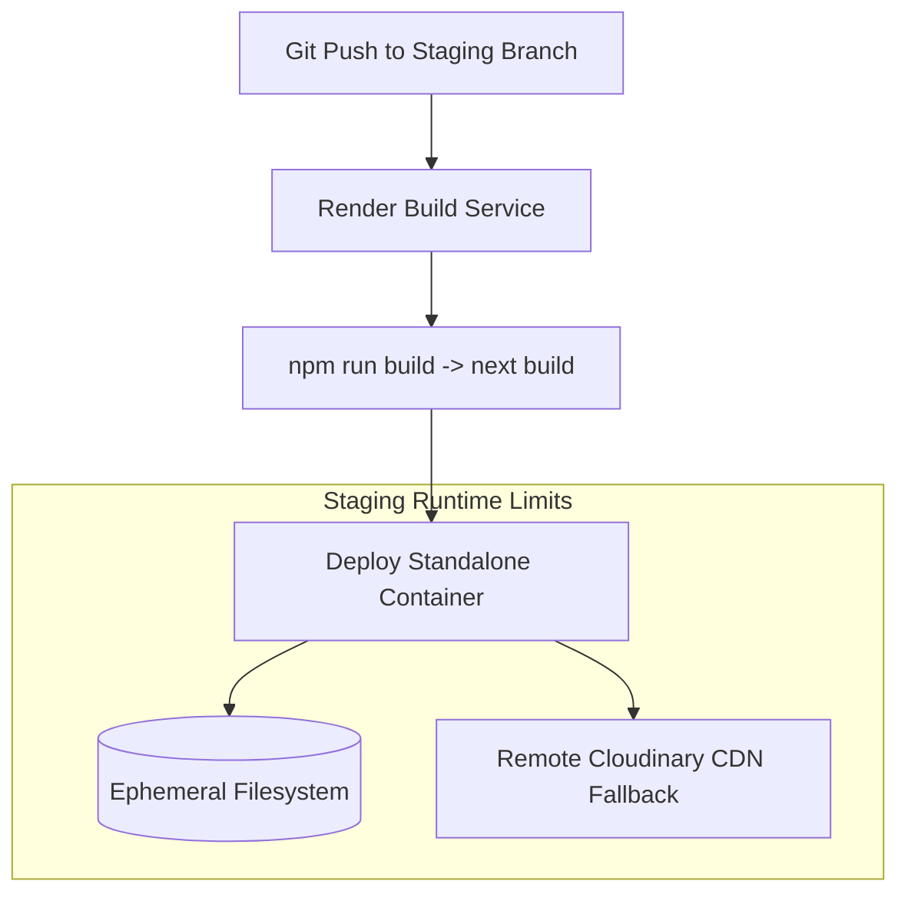

# Render PaaS Staging Deployment & Next.js Standalone Constraints

## 1. Render PaaS Staging Architecture

The Render PaaS platform hosts the staging and preview environments (`*.onrender.com`) for the KUCET College Management System. Render provides automated continuous integration from Git branches, managed HTTPS certificates, and container isolation.



### Environment Configuration on Render

| Parameter | Value | Purpose |
| :--- | :--- | :--- |
| **Environment** | `Node` | Node.js 20 LTS Runtime |
| **Build Command** | `npm install && npm run build` | Compiles Next.js standalone package |
| **Start Command** | `npm run start` | Launches `node server.js` inside standalone build |
| **STORAGE_TYPE** | `cloudinary` or `local` | Dictates asset storage strategy |
| **NEXT_PUBLIC_BASE_URL** | `https://kucet-staging.onrender.com` | Primary public URL on Render |

---

## 2. Next.js Standalone Runner Constraints

Next.js is configured with `output: 'standalone'` in `next.config.js` to minimize container deployment sizes. However, standalone mode introduces specific runtime constraints regarding working directory resolution.

### The `process.cwd()` Working Directory Mismatch

When Next.js runs in standalone mode, the execution root shifts from the repository root to the nested `.next/standalone` folder.

$$\text{Default Directory: } \text{/app}$$
$$\text{Standalone Directory: } \text{/app/.next/standalone}$$

As a result, standard relative file operations using `path.join(process.cwd(), 'public')` fail to locate public assets because `process.cwd()` evaluates to `/app/.next/standalone`.

```
/app/
├── public/                       # Original Repository Public Folder
└── .next/
    └── standalone/               # Standalone Runner Executable Location
        ├── server.js             # Standalone Entrypoint (process.cwd() = HERE)
        └── public/               # (Must be copied during build)
```

### Resolution via Multi-Candidate Path Resolver

To ensure institutional assets (seals, logos, Principal signatures) resolve seamlessly across both standalone Render containers and standard dev environments, [`InstitutionAssetService.js`](file:///D:/User/Desktop/CMS/src/services/institution/InstitutionAssetService.js) evaluates candidate paths relative to multiple directory levels:

```javascript
// Standalone-aware path resolver in InstitutionAssetService.js
const cwd = process.cwd();
const localCandidatePaths = [
  // Candidate 1: Standard repository layout
  path.join(cwd, 'public', 'assets', filename),
  path.join(cwd, 'public', filename),
  
  // Candidate 2: Standalone nested layout (moving 1 level up)
  path.resolve(cwd, '..', 'public', 'assets', filename),
  path.resolve(cwd, '..', 'public', filename),
  
  // Candidate 3: Deep standalone nested layout (moving 2 levels up)
  path.resolve(cwd, '..', '..', 'public', 'assets', filename),
  path.resolve(cwd, '..', '..', 'public', filename),
];
```

---

## 3. Content Security Policy (CSP) Directives for Render

Render subdomains (`*.onrender.com`) require explicit CSP header configurations to permit secure communication between client browsers, Next.js server actions, and Cloudinary CDN backends.

### Production & Staging CSP Specification

```http
Content-Security-Policy: 
  default-src 'self';
  script-src 'self' 'unsafe-inline' 'unsafe-eval' https://cdn.jsdelivr.net;
  style-src 'self' 'unsafe-inline' https://fonts.googleapis.com;
  img-src 'self' data: blob: https://res.cloudinary.com https://*.onrender.com;
  font-src 'self' data: https://fonts.gstatic.com;
  connect-src 'self' https://res.cloudinary.com https://*.onrender.com;
  frame-ancestors 'self';
  form-action 'self';
```

> [!IMPORTANT]
> The `img-src` and `connect-src` directives explicitly include `https://*.onrender.com` to prevent browser CORS blocks when proxying media requests through Render API endpoints.

---

## 4. Remote CDN Candidate Strategy

Render container instances run on an ephemeral filesystem: any file written to disk during container execution is destroyed when the service restarts or re-deploys.

To prevent broken image links on Render staging environments when local persistent disk storage is unavailable, `InstitutionAssetService` falls back to remote CDN fetching:

```javascript
// InstitutionAssetService.js remote CDN candidate fallback
const remoteCandidates = [
  `https://res.cloudinary.com/${cloudName}/image/upload/${filename}`,
  `https://res.cloudinary.com/${cloudName}/image/upload/f_auto,q_auto/${filename}`,
  `https://res.cloudinary.com/${cloudName}/image/upload/kucet/${filename}`,
];

for (const url of remoteCandidates) {
  try {
    const res = await fetch(url);
    if (res.ok) {
      const arrayBuf = await res.arrayBuffer();
      return Buffer.from(arrayBuf);
    }
  } catch (err) {
    logger.error({ err: err.message, url }, '[INSTITUTION_ASSET_FETCH_ERROR]');
  }
}
```

## 5. Render Build Memory Architecture & OOM Prevention

During Next.js production builds on Render's containerized build runners, memory consumption must be strictly budgeted to avoid container OOM kills (`Out of memory: used over 8Gi`).

### Root Causes of Build-Time Memory Spikes:
1. **Un-externalized Server Packages**: Heavy Node/WASM modules (`@aws-sdk/client-s3`, `@react-pdf/renderer`, `jimp`, `mysqldump`, `mysql2`, `docxtemplater`, `pizzip`, `web-push`, `bcrypt`, `pino`, `ioredis`) being parsed into Webpack/Turbopack AST graphs.
2. **Turbopack Whole-Project Dynamic Tracing**: Dynamic file system access (`fs.stat`, `path.resolve(process.cwd(), ...)`) triggering exhaustive project-wide file tracing into compiler memory.
3. **Uncapped Node.js V8 Heap**: Default V8 garbage collection thresholds scaling beyond container memory limits before triggering GC.

### Applied Mitigations:
1. **`serverExternalPackages` in `next.config.mjs`**:
   Instructs Next.js to leave heavy server libraries as external Node `require()` references rather than bundling their full source ASTs.
2. **`/*turbopackIgnore: true*/` Annotations**:
   Added to dynamic file inspection operations in `LocalStorageProvider.js` and `DatabaseBackupService.js` to prevent whole-project tracing warnings and AST memory bloat.
3. **Sentry Sourcemap Disabling on Build**:
   `sourcemaps: { disable: true }` in `withSentryConfig` to prevent in-memory sourcemap indexing during container builds.
4. **Render Environment Variable Configuration**:
   Configure the following environment variable in the Render Dashboard for the web service:
   ```env
   NODE_OPTIONS=--max-old-space-size=4096
   ```

---

## 6. Git Branching & Staging vs Production Separation

```mermaid
flowchart LR
    Dev[Feature Work] --> TestVanilla[testvanilla (Staging / Verification)]
    TestVanilla --> CI[GitHub Actions CI / Automated Tests]
    CI --> Main[main (Canonical / Production Source)]
    Main --> VPS[Hostinger Ubuntu VPS (Production Deployment)]
    TestVanilla -.-> Render[Render Preview / Staging (Optional)]
```

### Branch Strategy Rules:
- **`testvanilla`**: Active development and integration branch. Receives new features and bug fixes first.
- **`main`**: Canonical production branch. Receives merges from `testvanilla` only after all unit tests and builds pass.
- **Render Staging**: Should be configured to build from `testvanilla` or dedicated staging branches with `NODE_OPTIONS=--max-old-space-size=4096`.
- **Database Migrations**: Executed in GitHub Actions CI (`database-migration-runner`) and VPS deployment scripts. Never executed during static web builds.

---

## Cross-References

* [Self-Hosted VPS Production Setup](./vps.md)
* [Nginx Reverse Proxy Configuration](./nginx.md)
* [SSL/TLS Security & Domain Certificate Management](./ssl.md)
* [Universal Storage Abstraction Architecture](../storage/file-storage.md)

