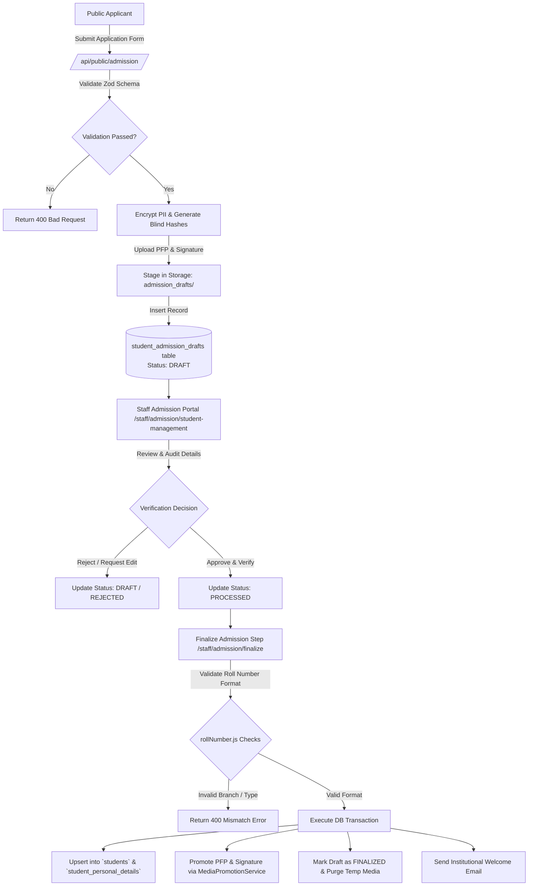
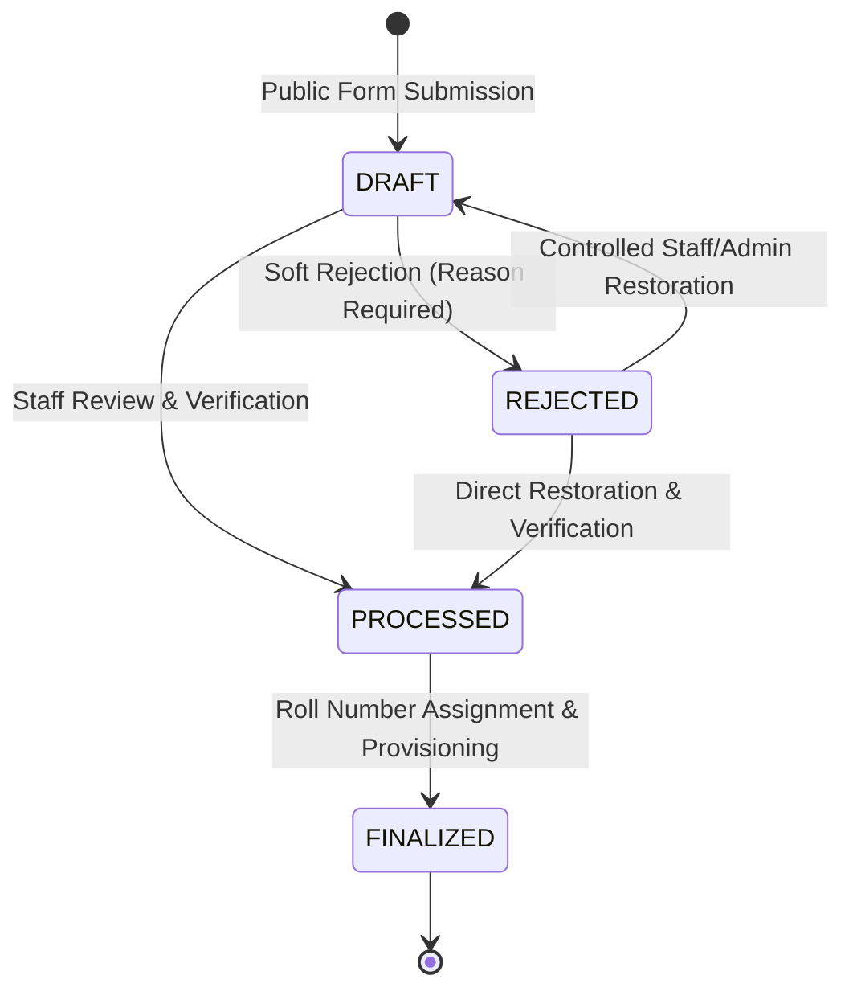
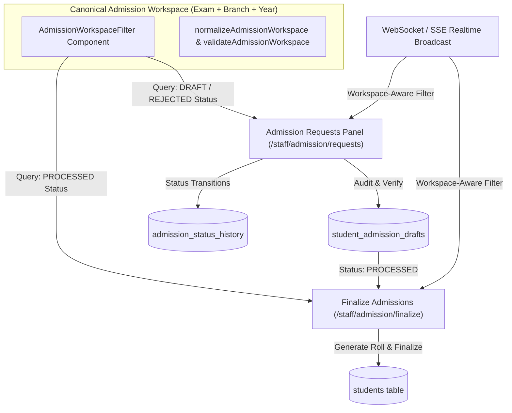
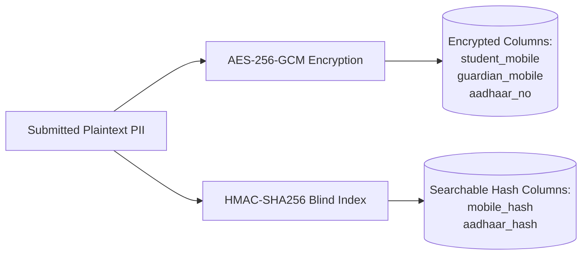

# Multi-Stage Admission System Documentation

## 1. Overview & Architecture

The **KUCET Multi-Stage Admission System** manages the entire lifecycle of student onboarding at Kakatiya University College of Engineering & Technology. It provides a secure public application portal, a multi-stage verification workflow for admission staff, automated roll number generation according to institutional standards, and atomic database provisioning.

The system handles both **Regular B.Tech (TG EAPCET)** and **Lateral Entry B.Tech (TG ECET)** admissions, standardizing complex category allocations, SC sub-castes, EWS reservations, and sensitive Personally Identifiable Information (PII) encryption.



---

## 2. Public Application Form (`/admission`)

The public admission portal allows prospective students to submit their demographic, academic, and reservation details online without needing pre-existing authentication credentials.

### Key API Endpoint: `POST /api/public/admission`

- **Rate Limiting**: Enforces a strict rate limit of 5 requests per hour per IP (`getTieredKey(req, 'admission')`) to prevent spam and denial-of-service attempts.
- **Zero-Trust Validation**: Every incoming payload is validated using a comprehensive Zod schema (`admissionSchema`).
- **Data Policy Consent**: Mandatory boolean capture (`legal_consent: true`). Submissions without consent are rejected with HTTP 400.

### Input Validation & Sanitization Schema

| Field Name | Type / Format | Validation Rules & Constraints |
| :--- | :--- | :--- |
| `name` | String | Standardized uppercase, min 3 chars, letters/dots/spaces only |
| `admission_year` | String | Regex pattern `^\d{4}-\d{2,4}$` (e.g., `2025-2026`) |
| `entrance_exam` | Enum | `TG EAPCET`, `TG ECET`, `PGECET`, `Other` |
| `branch` | String | Department short code (`CSE`, `ECE`, `EEE`, `CSD`, `CIVIL`, `IT`, `MECH`) |
| `student_mobile` | String | Exactly 10 digits (digits extracted via regex `\D`) |
| `aadhaar_no` | String | Exactly 12 digits (optional/nullable) |
| `dob` | String | Date string format `YYYY-MM-DD` |
| `category` | String | Primary category (`OC`, `BC-A`, `BC-B`, `BC-C`, `BC-D`, `BC-E`, `SC`, `ST`, `EWS`) |
| `sub_caste` | String | Specific sub-caste enumeration (e.g., `SC-A`, `SC-B`, `SC-C`, `SC-D`, `Mundari`, etc.) |
| `inter_diploma_marks` | Numeric String | Float between `0` and `1000` |
| `fee_reimbursement` | Enum | `YES`, `NO`, `GOV` |
| `legal_consent` | Boolean | Must explicitly evaluate to `true` |

---

## 3. Draft Management, Soft Rejection & Controlled Restoration

To ensure data integrity, public submissions are not placed directly into the active student registry. Instead, they follow a state machine pattern stored in the `student_admission_drafts` table, backed by an immutable `admission_status_history` audit trail.

### Draft Lifecycle States & State Machine



1. **`DRAFT`**: The initial state upon public submission. Sensitive details are encrypted, blind indices are created, and assets are saved in temporary staging storage (`admission_drafts/pfp/` and `admission_drafts/signatures/`).
2. **`REJECTED` (Soft Rejection)**: When staff rejects an application due to discrepancies (e.g. illegible certificate, memo mismatch), the record is **softly rejected** via `PUT /api/staff/admission/drafts/[id]`:
   - **Zero Physical Deletion:** The draft row remains in `student_admission_drafts` with `status = 'REJECTED'`.
   - **Proof Media Preserved:** All candidate uploaded photographs and signatures remain preserved in storage for audit compliance.
   - **Immutable History:** A status transition row is written to `admission_status_history` capturing old status, new status, rejection reason, actor staff ID, and timestamp.
   - **Student Email Notification:** Automated transactional email is dispatched explaining the rejection reason.
3. **`PROCESSED`**: The admission staff inspects physical certificates (SSC memo, Intermediate/Diploma memo, Caste certificate, Income certificate) and marks the draft verified.
4. **`FINALIZED`**: The staff member assigns an institutional roll number and finalizes admission. The record is migrated to active student tables, and temporary draft storage is cleaned up.

---

## 3.1. Candidate Re-Application & Uniqueness Rules

When an application is rejected, the applicant may need to submit a fresh application or have staff restore their record:

1. **Candidate Re-Application on `/admission`**:
   - The uniqueness checks (`email`, `mobile_hash`, `aadhaar_hash` in `src/app/api/public/admission/route.js`) explicitly exclude `status = 'REJECTED'` records (`and(eq(col, val), ne(studentAdmissionDrafts.status, 'REJECTED'))`).
   - Consequently, rejected candidates are **fully eligible to re-apply immediately** using their original email, phone number, and Aadhaar without encountering false positive duplication blocks.
2. **Staff/Admin Instant Record Restoration**:
   - Authorized staff can open the **Rejected Applications** tab in `/staff/admission/requests?tab=admissions`.
   - Clicking **Inspect / Restore** opens the audit modal with the complete **Lifecycle Status History & Audit Trail**.
   - Staff can invoke `POST /api/staff/admission/drafts/[id]/restore` with a mandatory `restoration_reason`, returning the application directly to the active `DRAFT` queue without forcing the student to re-enter data.

---

## 3.2. Canonical Admission Workspace Architecture

To prevent data drift and ensure that Admission Requests (`/staff/admission/requests?tab=admissions`) and Finalize Admissions (`/staff/admission/finalize`) operate on identical cohorts, the system establishes a canonical **Admission Workspace** concept defined in `@/lib/admission-workspace`:

$$\text{Admission Workspace} = \text{Intake Exam} + \text{Target Branch} + \text{Entry Year}$$



### Workspace Specifications & Rules
1. **Intake Exam (`intakeExam`)**: Validated against `ADMISSION_EXAM_OPTIONS` (`TG EAPCET`, `TG ECET`).
2. **Target Branch (`targetBranch`)**: Normalized to institutional branch codes (`CSE`, `CSD`, `ECE`, `EEE`, `CIVIL`, `IT`, `MECH`) or `ALL` (`All Branches`), which aggregates records across all permitted institutional departments.
3. **Entry Year (`entryYear`)**: 4-digit academic entry year (default: `getIntakeYear()`, e.g. `2026`).
4. **URL-Addressable Navigation**: Workspaces are synchronized to URL query parameters (`?exam=TG+EAPCET&branch=ALL&year=2026` or `branch=CSE`), allowing bookmarking, deep-linking, and browser back/forward navigation without full page reloads.
5. **Realtime Isolation & Aggregation**: WebSocket/SSE broadcast events (`ADMISSION_DRAFT_CREATED`, `ADMISSION_DRAFT_UPDATED`, `ADMISSION_DRAFT_FINALIZED`) verify `matchesAdmissionWorkspace(payload, workspace)` before modifying local component queues. When `targetBranch = ALL`, events for all permitted branches matching the exam and entry year trigger queue refresh; when filtered to a specific branch, foreign branch updates are isolated.

---

## 4. Alphanumeric Roll Number Generation Engine

KUCET follows a precise institutional roll number format implemented in `src/lib/rollNumber.js`. The format distinguishes between **Regular 4-Year B.Tech** and **3-Year Lateral Entry B.Tech (TG ECET)** students.

### Roll Number Structure & Patterns

```
Regular B.Tech (10 Characters):  [YY] 567 T [BB] [SS]
Lateral Entry  (11 Characters):  [YY] 567 T [BB] [SS] L   (or [YY]567[BB][SS]L)
```

- **`YY`**: 2-digit entry year (e.g., `22` for 2022, `25` for 2025).
- **`567`**: Kakatiya University institutional code for KUCET Warangal.
- **`T`**: Technical / Engineering Stream indicator suffix.
- **`BB`**: 2-digit Department / Branch Code.
- **`SS`**: 2-character Alphanumeric Serial Number (supports batches up to 1,296 students per branch, e.g., `01`..`99`, `A1`..`Z9`).
- **`L`**: Suffix designating TG ECET Lateral Entry.

### Branch Code Mapping (`branchCodes`)

| Branch Code | Department Name | Entrance Exam Qualified | Academic Duration |
| :---: | :--- | :--- | :--- |
| `09` | Computer Science & Engineering (CSE) | TG EAPCET / TG ECET | 4 Years (3 for Lateral) |
| `30` | Computer Science & Data Science (CSD) | TG EAPCET / TG ECET | 4 Years (3 for Lateral) |
| `15` | Electronics & Communication (ECE) | TG EAPCET / TG ECET | 4 Years (3 for Lateral) |
| `12` | Electrical & Electronics (EEE) | TG EAPCET / TG ECET | 4 Years (3 for Lateral) |
| `00` | Civil Engineering (CIVIL) | TG EAPCET / TG ECET | 4 Years (3 for Lateral) |
| `18` | Information Technology (IT) | TG EAPCET / TG ECET | 4 Years (3 for Lateral) |
| `03` | Mechanical Engineering (MECH) | TG EAPCET / TG ECET | 4 Years (3 for Lateral) |

### Batch Year Calculation Rules

The system automatically calculates student cohort batches using `getBatchFromRoll(rollNo)`:
- **Regular Entry**: `batchStart = 2000 + YY`, `batchEnd = batchStart + 4`. Cohort = `2022-2026`.
- **Lateral Entry (`L`)**: `batchStart = (2000 + YY) - 1`, `batchEnd = batchStart + 4`. Lateral entry students admitted in 2023 join the 2nd year of the 2022-2026 batch.

---

## 5. SC Sub-Castes & EWS Standardization

The KUCET admission module enforces government reservation guidelines for Telangana higher education institutions.

### SC Sub-Caste Categorization
To satisfy statutory reporting standards, the system mandates recording SC sub-castes (`SC-A`, `SC-B`, `SC-C`, `SC-D`). 
- In public and clerk forms, selecting category `SC` dynamically opens sub-caste inputs.
- Validated via `z.string().trim().max(100)` and standardized before entry into `student_admission_drafts.sub_caste` and `student_personal_details.sub_caste`.

### Economically Weaker Sections (EWS) Standardization
- General category applicants eligible for EWS reservation are flagged with `category = 'EWS'`.
- The allotment category (`seat_allotted_category`) preserves the exact seat quota under which the convener allotted the seat (e.g., `REG_EWS_OPEN`, `REG_BC_B_GIRLS`).
- Fee reimbursement eligibility (`fee_reimbursement: YES | NO | GOV`) is checked against income thresholds (up to ₹2,00,000 for SC/ST and ₹1,00,000/₹2,00,000 for EWS/BC depending on state notification).

---

## 6. PII Security, Consent & Encryption Architecture

Student data privacy is enforced through field-level encryption, blind indexing, and cryptographic consent recording.



### Cryptographic Security Controls
1. **AES-256-GCM Encryption**: Sensitive fields (`student_mobile`, `guardian_mobile`, `aadhaar_no`) are encrypted prior to storage in MySQL using the system encryption key (`ENCRYPTION_KEY`). Plaintext phone numbers or Aadhaar numbers are never stored in raw text.
2. **Blind Indexing (`hashForIndex`)**: To enable database lookups for uniqueness checks without decrypting all rows, the system creates deterministic HMAC-SHA256 hashes stored in `mobile_hash` and `aadhaar_hash`.
3. **Consent Timestamping**: The exact server timestamp of legal policy agreement is saved in `data_policy_consented_at` using `getNow()`.

---

## 7. Atomic Finalization & Student Provisioning

When an admission staff member finalizes a verified draft via `POST /api/staff/admission/drafts/[id]/finalize`, the system executes an atomic transaction.

```javascript
// Source: src/app/api/staff/admission/drafts/[id]/finalize/route.js
const result = await db.transaction(async (tx) => {
  // 1. Lock draft row for update
  const draft = await tx.select().from(studentAdmissionDrafts)
    .where(eq(studentAdmissionDrafts.id, id))
    .for('update');

  // 2. Validate roll number branch & admission type consistency
  const parsed = validateRollNo(rollNo);
  if (parsed.branch !== draft.branch) throw new Error('ROLL_BRANCH_MISMATCH');

  // 3. Upsert active student records
  const studentId = await StudentService.upsertStudent(studentData, clerkId, tx);

  // 4. Promote temporary draft assets to permanent storage
  await MediaPromotionService.promoteAdmissionMedia({ studentId, pfp: draft.pfp, signature: draft.signature }, tx);

  // 5. Update draft status & purge staging assets
  await tx.update(studentAdmissionDrafts)
    .set({ status: 'FINALIZED', pfp: null, signature: null })
    .where(eq(studentAdmissionDrafts.id, id));

  return { studentId, rollNo };
});
```

### Post-Finalization Automated Actions
- **Idempotency Guard**: Protects against double-submits via `idempotency-key` HTTP headers managed by `IdempotencyService`.
- **Welcome Email Dispatch**: Asynchronously sends an institutional onboarding email with login credentials (default password set to Date of Birth `YYYY-MM-DD`).
- **Audit Logging**: Inserts an immutable log entry into audit tables (`action: 'FINALIZE_ADMISSION'`).

---

## 8. Finalize Admissions Workspace & Scoped Branch Filter

On `/staff/admission/finalize`, clerks perform final enrollment, verify physical certificates, assign institutional roll numbers, and promote student drafts into active database tables.

### Scoped Branch Selection Invariant (`allowAllBranches={false}`)

1. **Cohort-Specific Operational Requirement**:
   - Finalizing admissions requires focused batch processing by specific engineering department cohorts (e.g. `CSE`, `CSD`, `ECE`, `EEE`, `CIVIL`, `IT`, `MECH`).
   - Selecting "All Branches" during finalization causes roll-number allocation confusion and cross-branch batching errors.
2. **Targeted UI Isolation**:
   - `AdmissionWorkspaceFilter.js` accepts the prop `allowAllBranches={false}` on `/staff/admission/finalize`.
   - The dropdown strictly renders only the individual engineering branches (`CSE`, `CSD`, `ECE`, `EEE`, `CIVIL`, `IT`, `MECH`) without "All Branches".
   - It defaults gracefully to the first department cohort (`CSE`), loading eligible finalizable students immediately upon page load.
3. **Global Preservation Guarantee**:
   - "All Branches" is strictly preserved across all other admission and reporting pages:
     - Student Registry (`/staff/admission/registry`)
     - Admission Requests (`/staff/admission/requests`)
     - Admission Dashboard & Reports (`/staff/admission/dashboard`)
     - Draft Admissions Workspace (`/staff/admission/drafts`)
     - Finalized Students Directory (`/staff/admission/finalized`)
     - Super Admin and Student Console filters

---

## 9. Admission Draft Sorting Toggle (Admission Intake Only)

In `/staff/admission/requests` under the **Admission Intake** (`mode === 'DRAFT'`) tab, admission clerks can toggle the presentation order of student applications.

### Operational Requirements & Invariants
1. **Scope Restriction**: The sorting toggle is strictly rendered **ONLY** on the Admission Draft / Admission Intake tab (`/staff/admission/requests?tab=admissions`). It is explicitly forbidden and absent from:
   - Finalize Admissions (`/staff/admission/finalize`)
   - Finalized Students directory (`/staff/admission/finalized`)
   - Student Registry & other administrative tables
2. **Default State**: Latest First (`sortMode = 'latest'`). Student applications are ordered by `created_at DESC, id DESC`.
3. **Alphabetical State**: Name A to Z (`sortMode = 'name'`). Student applications are ordered alphabetically by student name (`name ASC, id ASC`) using deterministic case-insensitive collation.
4. **Universal Branch Support**: Operates consistently across `All Branches` as well as individual department cohorts (`CSE`, `CSD`, `ECE`, `EEE`, `CIVIL`, `IT`, `MECH`).
5. **Composability**: Integrates seamlessly with all workspace filters:
   - Intake Exam (`TG EAPCET`, `TG ECET`, etc.)
   - Target Branch
   - Entry Year
   - Real-time text search
6. **State Preservation**: The active sort preference (`sortMode`) is preserved across branch switches, exam filter adjustments, and manual workspace synchronizations without resetting to default.

---

## 10. Cross-References

- Database Schemas: [schema.md](../database/schema.md)
- Storage Lifecycle & Media Promotion: [requests.md](./requests.md)
- Institutional Certificates: [certificates.md](./certificates.md)
- Identity & User Management: [authentication.md](../authentication/authentication.md)
