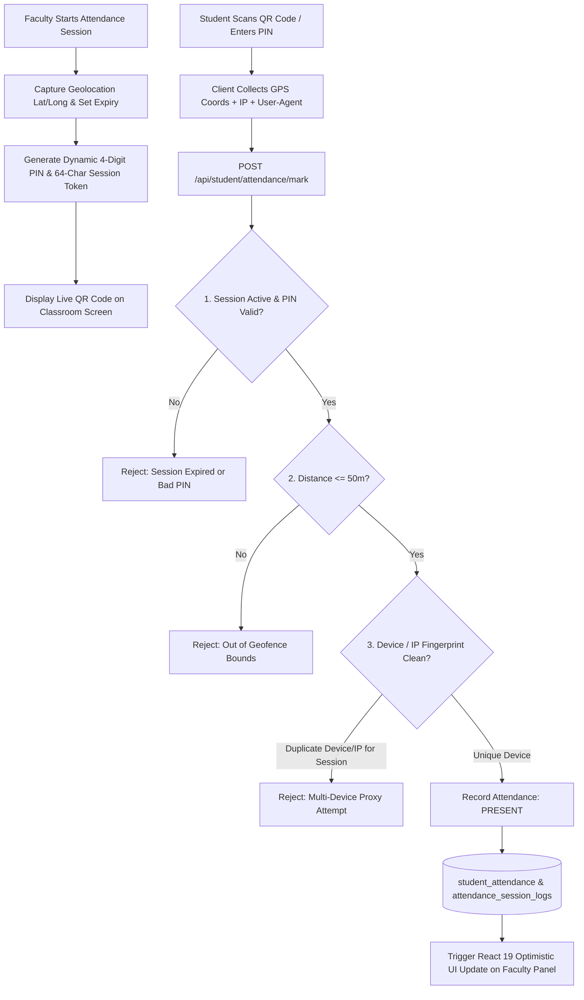
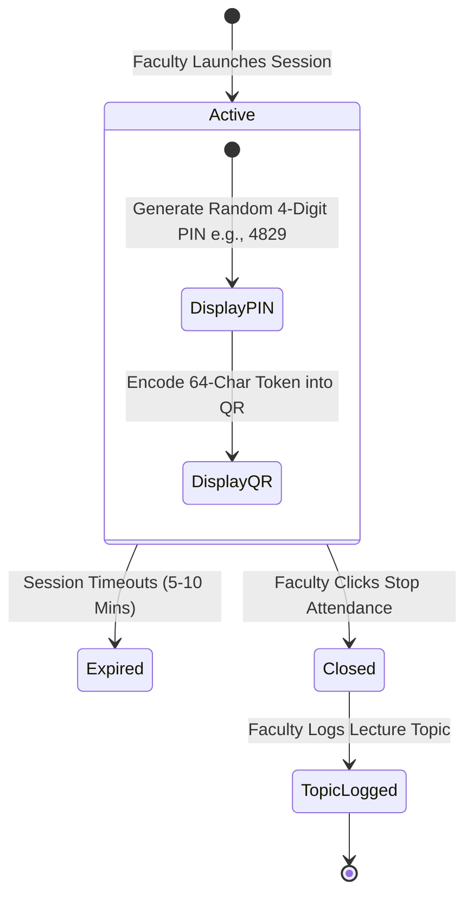

# Proxy-Free Attendance System Documentation

## 1. Overview & Security Philosophy

The **KUCET Proxy-Free Attendance System** eliminates traditional roll-call proxy attendance through multi-factor cryptographic and physical verification. It enforces spatial geofencing, temporal dynamic PINs, encrypted QR token scanning, device fingerprinting, and IP address logging.

Faculty members start live attendance sessions from their mobile or desktop devices. Students within a 50-meter campus geofence scan a dynamic QR code or submit a 4-digit PIN while their device fingerprint and location are verified in real time.



---

## 2. 50m GPS Geofence Verification Engine

To ensure students are physically present inside the designated lecture hall or lab, the system computes the spatial distance between the faculty member's device location and the student's submission location using the **Haversine Distance Formula**.

### Spatial Distance Calculation Algorithm

```javascript
/**
 * Computes surface distance between two WGS84 coordinates in meters
 */
function haversineDistance(lat1, lon1, lat2, lon2) {
  const R = 6371000; // Earth's radius in meters
  const dLat = (lat2 - lat1) * (Math.PI / 180);
  const dLon = (lon2 - lon1) * (Math.PI / 180);
  
  const a = 
    Math.sin(dLat / 2) * Math.sin(dLat / 2) +
    Math.cos(lat1 * (Math.PI / 180)) * Math.cos(lat2 * (Math.PI / 180)) * 
    Math.sin(dLon / 2) * Math.sin(dLon / 2);
    
  const c = 2 * Math.atan2(Math.sqrt(a), Math.sqrt(1 - a));
  return R * c;
}
```

### Geofence Enforcement Parameters

| Parameter | Operational Value | Verification Rule |
| :--- | :--- | :--- |
| **Max Radius Boundary** | `50.0 Meters` | Submissions where `distance > 50.0m` are rejected (`FAILED_LOCATION`). |
| **GPS Accuracy Threshold** | `<= 25.0 Meters` | If device reports accuracy `> 25m`, student is prompted to enable High Accuracy Location Services. |
| **Database Precision** | `decimal(10, 8)` / `decimal(11, 8)` | High precision latitude/longitude storage in `attendance_sessions`. |

---

## 3. Dynamic 4-Digit PINs & Tokenized Session Lifecycle

Attendance sessions are short-lived to prevent remote code sharing via messaging apps.



### Session Lifecycle Rules
1. **Dynamic Generation**: When faculty clicks "Start Session", the backend generates a random 4-digit PIN (`session_pin`) and a cryptographically secure 64-character token (`session_token`).
2. **Short TTL Expiry**: Sessions auto-expire after a configured window (typically 5 to 10 minutes).
3. **Session Re-keying**: Faculty can refresh the PIN at any time during an active lecture to invalidate previously shared PINs.
4. **Session Termination Authorization (`DELETE /api/staff/faculty/attendance/session`)**: Active sessions can be terminated by the primary assigned faculty, the session creator (such as a designated substitute for the day), the Head of Department (HOD) for that branch, or a Super Admin. Unauthorized termination attempts are rejected with 403 Forbidden.

---

## 4. Alphanumeric QR Code Scanning (`QRScannerPanel.js`)

The front-end scanner component (`src/components/staff/faculty/QRScannerPanel.js`) provides an interactive camera interface for scanning dynamic session QR codes.

### Key Technical Characteristics
- **Dynamic Encoding**: The QR code encodes a high-entropy session URL:  
  `https://cms.kucet.ac.in/student/attendance/scan?token=e3b0c44298fc1c149afbf4c8996fb92427ae41e4649b934ca495991b7852b855`
- **Auto Camera Selection**: Uses WebRTC `getUserMedia()` prioritizing environment/rear facing cameras on mobile browsers.
- **Client-Side Decoding**: Processes frames using `jsQR` canvas analysis to extract session tokens instantly.

---

## 5. Device & Network Fingerprinting (`attendance_session_logs`)

To prevent a single student from logging in on multiple phones or submitting attendance for absent peers, every submission creates a audit record in `attendance_session_logs`.

```javascript
// Source: src/db/schema/attendance.js
export const attendanceSessionLogs = mysqlTable('attendance_session_logs', {
  id: int('id').autoincrement().primaryKey().notNull(),
  session_id: int('session_id').notNull(),
  student_id: int('student_id').notNull(),
  device_hash: varchar('device_hash', { length: 255 }),
  ip_address: varchar('ip_address', { length: 45 }),
  ua_hash: varchar('ua_hash', { length: 32 }),
  status: mysqlEnum('status', ['SUCCESS', 'FAILED_LOCATION', 'FAILED_EXPIRED', 'FAILED_PIN', 'LOCKED']),
  created_at: timestamp('created_at').defaultNow(),
}, (table) => ({
  sessionIpUaIdx: index('idx_session_ip_ua').on(table.session_id, table.ip_address, table.ua_hash),
  studentSessionIdx: index('idx_asl_student_session').on(table.student_id, table.session_id),
}));
```

### Fraud Prevention Rules
- **Hardware Device Lock (`device_hash`)**: Browser storage UUID and device fingerprinting produce a unique client `device_hash`. A single physical device cannot mark attendance for more than one student per lecture session (`finalDeviceId` check). Attempts from the same device for multiple student roll numbers are strictly locked out with both records marked `ABSENT`.
- **Campus Wi-Fi NAT & Network Telemetry**: In university classrooms, all students connect to the department access point sharing a single egress NAT IP and common mobile browser user-agents. While `ip_address` and `ua_hash` are logged for forensic audit telemetry (`[ATTENDANCE_NETWORK_TELEMETRY]`), they do not trigger false-positive proxy penalties across different physical devices.

---

## 6. Lecture Topic Tracking (`LectureTopicModal.js` & Inline Panels)

To comply with NBA/NAAC syllabus coverage audits, faculty members must log the curriculum topics covered during each session.

### Dual Entry Workflows
1. **Inline Quick-Save Panel**: Both desktop (`AttendanceSheet.js`) and mobile (`MobileAttendanceSheet.js`) feature an inline "Topic Completed / Lecture Notes" panel. Faculty can type topics directly into the sheet at any time and click **"Save Topic"** (`PATCH /api/staff/faculty/attendance/session/topic`) or save atomically alongside attendance marks (`POST /api/staff/faculty/attendance`).
2. **Post-Session Modal**: When faculty clicks **"Stop Session"**, `LectureTopicModal.js` appears as a confirmation dialog to verify or enter topic descriptions before concluding.
3. **Session Query Integration**: Whenever a past date or session number is selected on the attendance roster, `GET /api/staff/faculty/attendance/status` automatically queries `attendance_sessions` and populates the recorded topic.

---

## 7. Deterministic Roster State Management & React 19 Stability

The faculty live monitoring UI utilizes deterministic React state management in `FacultyAttendanceContext.js` to ensure zero rendering collisions and instant optimistic-feeling responsiveness across GPS, QR, and Manual entry modes.

### Stability & Concurrency Guardrails
- **Pure State Updaters**: State setters (`attendanceStatusMap`, `absentCountMap`) avoid nesting `startTransition` or secondary dispatchers inside state updater functions, preventing React Error #479 (`dispatchOptimisticSetState` / nested transition collision).
- **Batch Updates**: `setBatchAttendanceStatus()` enables bulk updates (e.g., "Confirm All", "Follow Previous Session") in a single render pass.
- **Proxy Token Header Forwarding**: Edge proxy (`src/proxy.js`) forwards refreshed JWT tokens via `x-staff-auth` request headers, ensuring immediate authentication without downstream 401 drops.
- **Role & Substitution Hierarchy**: Attendance status queries, assignment lookups, and topic logging support primary faculty, assigned substitute faculty (`faculty_substitutions`), department HODs, and Super Admins.

---

## 8. Hardened Student PIN & GPS Verification Workflow

In `POST /api/student/attendance/verify`, student attendance submission via 4-digit PIN or dynamic QR token is hardened with multi-layer verification and atomic persistence.

### Verification Lifecycle
1. **Granular Session State Inspection**:
   - HTTP 404: Session does not exist.
   - HTTP 403: Session is inactive (`is_active = 0`) with explicit message *"This attendance session has ended or is closed"*.
   - HTTP 403: Session has expired (`expires_at <= now`) with explicit message *"This attendance session has expired"*.
2. **Student Department & Semester Eligibility**:
   - The student's department code (derived from institutional roll number or registry record) must strictly match the assigned course branch. Cross-department PIN submission is rejected with HTTP 403.
   - The student's current academic semester (computed via `calculateYearAndSemesterAsync`) is verified against the course semester.
3. **Multi-Check Duplicate Prevention**:
   - Prevents duplicate requests by inspecting both `attendanceSessionLogs` (returns HTTP 409 if status is already `SUCCESS`) and `studentAttendance` (returns HTTP 409 if status is already `PRESENT`).
4. **Immediate Atomic Attendance Commitment**:
   - Verified student submissions are committed in an atomic `db.transaction()` that simultaneously inserts the audit record into `attendanceSessionLogs` AND upserts the student's status as `PRESENT` in `studentAttendance` using the canonical assignment ID. This guarantees students are marked present immediately without relying on manual faculty panel re-saves.

---

## 9. Cross-References

- Examinations & Evaluation System: [examinations.md](./examinations.md)
- Institutional Reports & Attendance Archival: [reports.md](./reports.md)
- Database Attendance Schema: [schema.md](../database/schema.md)
- Student Request System: [requests.md](./requests.md)
