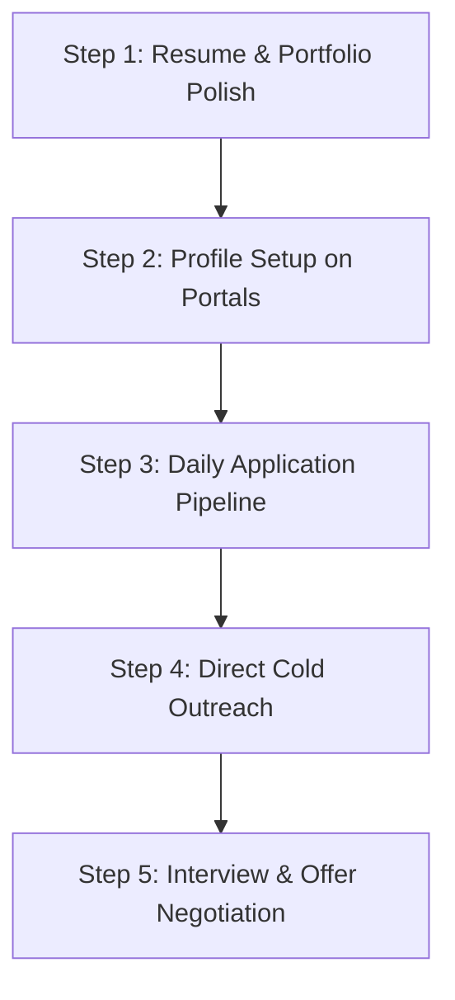

# 🚀 Custom Job Search & Application Strategy for Pasunooti Sannith

**Target Salary & Location Criteria:**
- 🏠 **Remote Roles:** ₹3.0 LPA – ₹6.0+ LPA
- 🏢 **Non-Remote (Hyderabad / Bengaluru / Onsite / Hybrid):** ₹6.0 LPA – ₹10.0+ LPA
- 🎯 **Target Position Categories:** Agentic AI / LLM Engineer, Next.js / MERN Full-Stack Engineer, Data Analyst / BI Developer, IoT / Embedded Software Engineer.

---

## 📌 Executive Profile Positioning

Based on your comprehensive profile in `GEMINI.md`, your key differentiators for employers are:

| Domain | Key Highlights to Emphasize |
| :--- | :--- |
| **Agentic AI & RAG** | Healthcare Monitoring AI Agent (LangChain + Groq Llama 3.3 70B + ChromaDB + HuggingFace), MindFlow AI (Gemini Flash API + Express). Google 5-Day AI Agents Intensive alumni. |
| **Full Stack (Next.js/Node)** | KUCET CMS (Docker, Server-Sent Events, Next.js), Keyboard-Combat (Supabase, Express, Zustand), React Native Solo Leveling App. |
| **Data Analytics** | Deloitte Data Analytics Simulation, PI LABS Graduate Cert, Proxenix Data Science Internship, Tableau & SQL modeling. |
| **Cloud & DevOps** | Google Cloud Innovator, AWS LAMP hosting, Docker, Cloudflare Tunnels. |
| **Hardware & IoT** | ESP32 C++ wireless motor controller, 48V/60V EV BMS battery pack engineering, Micro-soldering. |

---

## 🔍 Top Hiring Platforms & Live Job Portals

### 1. **Remote Job Portals (₹3–6 LPA & Above)**
1. **[Cutshort.io](https://cutshort.io)** - Highest response rate for Indian startups hiring remotely. Filter: `0-2 YOE`, `Remote`, `React/Next.js/Python`.
2. **[Wellfound (AngelList)](https://wellfound.com)** - Ideal for early-stage AI & Full-Stack startups. Filter: `Remote - India`, `Junior Full Stack / AI Engineer`.
3. **[Instahyre](https://www.instahyre.com)** - AI-driven recruiter matching. Set profile to `Open to Remote` & ` Hyderabad/Bengaluru`.
4. **[Remote Rocketship](https://remoterocketship.com)** & **[Remotive](https://remotive.com)** - Verified global & India-friendly remote software jobs.
5. **[Arc.dev](https://arc.dev)** - High-quality remote tech roles.
6. **[GeeksforGeeks Get Hired](https://www.geeksforgeeks.org/jobs)** - Great for freshers & 0-1 YOE tech roles.

### 2. **Hyderabad & Bengaluru Onsite/Hybrid Portals (₹6.0 LPA+)**
1. **LinkedIn Jobs:**
   - Search Query 1: `("AI Engineer" OR "LLM Engineer" OR "RAG") AND ("Hyderabad" OR "Bengaluru")`
   - Search Query 2: `("Next.js" OR "Full Stack Developer") AND ("Hyderabad" OR "Bengaluru")`
   - Filter: `Experience: Entry level / Associate`, `Location: Hyderabad / Bengaluru`.
2. **Naukri.com:**
   - Filter: `Experience: 0-1 years`, `Desired CTC: 6 - 10 LPA`, `Location: Hyderabad / Secunderabad / Bengaluru`.
3. **Hirist / Instahyre:**
   - Premium product firm listings in Gachibowli, Hitec City (Hyderabad) and HSR, Koramangala (Bengaluru).

---

## 💼 Matching Job Roles & Target Profiles

### Role Category 1: Agentic AI & RAG Engineer / AI Developer
- **Target CTC:** ₹6.0 – ₹10.0 LPA (Onsite/Hybrid) | ₹4.0 – ₹7.0 LPA (Remote)
- **Primary Keywords:** `LLM`, `RAG`, `LangChain`, `Groq`, `ChromaDB`, `FastAPI`, `Python`, `Vector DB`
- **Why You Fit:** You built a production-grade Healthcare Monitoring RAG system with ChromaDB and Llama 3.3, plus completed Google's 5-Day AI Agents Intensive.
- **Target Companies:** AI-native startups (e.g., Enterprise Bot, Yellow.ai, Sarvam AI, Bhavish Aggarwal's Krutrim, Fractal Analytics, H2O.ai, localized AI labs in Hyderabad/Bengaluru).

### Role Category 2: Full-Stack Engineer (Next.js / Node.js / TypeScript)
- **Target CTC:** ₹6.0 – ₹8.0 LPA (Onsite/Hybrid) | ₹3.5 – ₹6.0 LPA (Remote)
- **Primary Keywords:** `Next.js`, `React 19`, `Node.js`, `Express`, `TypeScript`, `Supabase`, `Docker`, `Tailwind CSS v4`
- **Why You Fit:** Production experience building KUCET CMS (SSE, Docker, Next.js) and Keyboard-Combat (Supabase, Express API).
- **Target Companies:** Mid-stage tech startups on Wellfound & Cutshort, SaaS providers in Hyderabad (e.g., Darwinbox, Zenoti, HighRadius, HighLevel, ValueLabs).

### Role Category 3: Data Analyst / Analytics Engineer
- **Target CTC:** ₹6.0 – ₹8.0 LPA (Onsite/Hybrid) | ₹3.5 – ₹5.0 LPA (Remote)
- **Primary Keywords:** `SQL`, `Python`, `Tableau`, `Data Modeling`, `Excel`, `R`
- **Why You Fit:** Deloitte Job Simulation, PI LABS Graduate Cert, Proxenix Data Science internship, robust mathematical background.
- **Target Companies:** Analytics consultancies (Tiger Analytics, Mu Sigma, Deloitte, KPMG, Fractal Analytics, LatentView).

---

## 📧 Cold Outreach & Direct Application Templates

When applying to founders, hiring managers, or tech leads on LinkedIn or via email, standard resumes are often overlooked. Use these high-conversion, personalized pitch templates:

### Template A: Cold Pitch for Agentic AI / RAG Engineer (LinkedIn / Email)

> **Subject:** Application for Junior AI / LLM Engineer – Full-Stack & RAG Specialist (KUCET CSE '26)
> 
> Hi **[Hiring Manager Name / Tech Lead]**,
> 
> I noticed you are expanding the AI engineering team at **[Company Name]**. I am a CSE Senior at Kakatiya University (Google Cloud Innovator & Google Developer Program Premium Member) with hands-on experience architecting production Agentic AI systems.
> 
> A few highlights of what I’ve built:
> 1. **Healthcare Monitoring AI Agent:** Engineered a RAG system using **LangChain, Groq (Llama 3.3-70b), ChromaDB vector embeddings**, and FastAPI for clinical document QA with emergency guardrails.
> 2. **MindFlow AI:** Built a mental stress evaluation engine powered by **Gemini AI API**, Express, JWT, and custom health scoring logic.
> 3. **AI Agents Intensive:** Certified in Google/Kaggle's 5-Day AI Agents program focused on autonomous tool calling & multi-agent orchestration.
> 
> I am proficient in **Python, FastAPI, Next.js, Node.js, and TypeScript**. I am actively looking for **[Remote / Hyderabad / Bengaluru]** roles starting at **[Target CTC, e.g. ₹6-8 LPA]**.
> 
> I would love to showcase my project demos or take a short technical task. Here is my GitHub: **[Your GitHub Link]** and Portfolio: **[Your Portfolio Link]**.
> 
> Best regards,  
> **Pasunooti Sannith**  
> 📱 +91-XXXXX-XXXXX | 📧 sannith@example.com

---

### Template B: Cold Pitch for Next.js / Full-Stack Engineer

> **Subject:** Full-Stack Engineer (Next.js / Node / TypeScript) – CSE Senior & Builder
> 
> Hi **[Hiring Manager / Founder Name]**,
> 
> I saw that **[Company Name]** is building **[Company product/tech]**. As a Full-Stack Developer specializing in Next.js, Node.js, and real-time backend architecture, I'd love to contribute.
> 
> Key projects I’ve architected:
> - **KUCET College Management System:** Production Next.js platform using **Docker, Server-Sent Events (SSE)** for real-time schedule sync, and automated GPS attendance.
> - **Keyboard-Combat:** Real-time typing app built with **React, TypeScript, Tailwind v4, Zustand, Supabase**, and Express middleware.
> 
> I operate comfortably across **React/Next.js, Node.js, PostgreSQL/Supabase, Docker**, and AI API integrations.
> 
> I am ready to join immediately or upon graduation for **[Remote (₹4-6 LPA) / Hyderabad (₹6-8+ LPA)]** roles.
> 
> Looking forward to connecting!  
> **Pasunooti Sannith**  
> GitHub: **[Your GitHub Link]**

---

## ⚡ Action Plan: Step-by-Step Execution Guide

### Step 1: Resume & LinkedIn Alignment (1-2 Hours)
- **Title on LinkedIn:** `Full Stack & AI Engineer | Next.js, FastAPI, LangChain, RAG | Google Cloud Innovator | B.Tech CSE '26`
- **Featured Section:** Link your GitHub repositories for **Healthcare Monitoring AI Agent**, **KUCET CMS**, and **MindFlow AI**.
- **Resume Tailoring:**
  - Create **Version A (AI / LLM Focus)** emphasizing RAG, ChromaDB, Groq, Gemini API, Python, LangChain.
  - Create **Version B (Full Stack Focus)** emphasizing Next.js, Node.js, Docker, SSE, Supabase, Tailwind, TypeScript.
  - Create **Version C (Data Analytics Focus)** emphasizing Deloitte Simulation, PI LABS Cert, Tableau, SQL, Data Modeling.

### Step 2: Set Up Daily Job Alerts
- Set job alerts on **Cutshort, Wellfound, LinkedIn, and Instahyre** for:
  - `Junior AI Engineer` (Remote & Hyderabad/Bengaluru)
  - `Next.js Developer` (Remote & Hyderabad/Bengaluru)
  - `Full Stack Developer` (Remote & Hyderabad/Bengaluru)
  - `Data Analyst` (Remote & Hyderabad/Bengaluru)

### Step 3: Application & Outreach Daily Quota
- 📩 **10 Direct Applications per day** via Cutshort / Wellfound / LinkedIn.
- 💬 **5 Personalized InMails / Emails per day** to Founders / Tech Leads at YC startups or Hyderabad product firms.

### Step 4: Salary Negotiation Tactics
- You already have a campus baseline offer from **BrightLine (2.4 - 3.0 LPA)** starting July 2026.
- **For Remote Roles:** Position your minimum expectation at **₹4.5 - ₹6.0 LPA**. Highlight your ability to work autonomously with modern AI tools (Cursor, Claude Code, GitHub Copilot) to deliver code 3x faster.
- **For Hyderabad/Bengaluru Onsite Roles:** Frame your target at **₹6.5 - ₹8.5 LPA**. Use your production deployment experience (KUCET CMS, Healthcare RAG Agent) to demonstrate you don't require training delays and can ship features from Day 1.

---

## 📌 Summary Checklist for Sannith

- [x] Resume versions aligned for AI, Full-Stack, and Data roles.
- [x] Profiles active on Cutshort, Wellfound, Instahyre, and LinkedIn.
- [x] GitHub repositories pinned with READMEs showcasing live demo URLs or video walkthroughs.
- [x] Target salary floors established: Remote (3-6 LPA), Onsite (6+ LPA).
